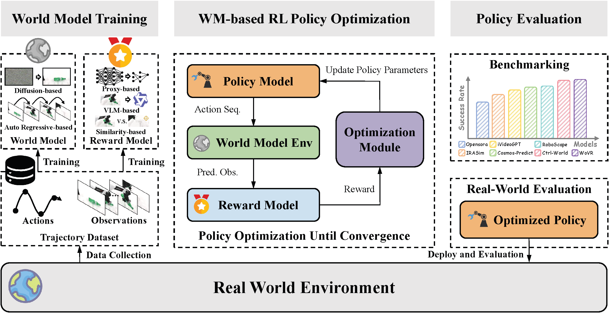

# WorldArena 2.0: Extending Embodied World Model Benchmarking on Modality, Functionality and Platform

## Table of Contents

- [Overview](#-overview)
- [Visuotactile World Model Evaluation](#-visuotactile-world-model-evaluation)
- [World Model Evaluation as RL Environments](#-world-model-evaluation-as-RL-environments)
- [Cross-Embodiment Sim-to-Real Evaluation](#-cross-embodiment-sim-to-real-evaluation)
- [Leaderboard](#-leaderboard)

## 🔍 Overview

**WorldArena 2.0** is the next-generation benchmark for embodied world models, built upon **WorldArena**, the first unified benchmark that jointly evaluates perceptual quality and embodied functionality. While WorldArena established a systematic framework for assessing world models as video predictors, data engines, policy evaluators, and action planners, WorldArena 2.0 further extends the benchmark along three key dimensions: **Modality Extension**, **Functionality Extension**, and **Platform Extension**.

* **Modality Extension:** from vision-only evaluation to visuotactile evaluation, enabling assessment of multimodal world models that jointly reason about visual observations and tactile interactions.
* **Functionality Extension:** from offline policy evaluation and planning to online reinforcement learning, evaluating whether world models can serve as stable interactive environments for policy optimization.
* **Platform Extension:** from simulator-only benchmarks to both simulated and real-world robotic systems, providing a more realistic measure of deployment capability.

Under a unified evaluation protocol, WorldArena 2.0 systematically measures perceptual quality, embodied task utility, and sim-to-real transferability across diverse world models. By connecting multimodal perception, interactive learning, and real-world deployment, WorldArena 2.0 establishes a rigorous benchmark for tracking progress toward practical embodied world models.

## ✋ Visuotactile World Model Evaluation

Please refer to [visual-tactile](https://github.com/WorldArena2/WorldArena-2.0/blob/main/visual-tactile_world_model_pipeline/README.md) for implementation.

## 🌍 World Model Evaluation as RL Environments

Please refer to [RL_env](https://github.com/WorldArena2/WorldArena-2.0/blob/main/visual-tactile_world_model_pipeline/README.md) for implementation.

## 🤖 Cross-Embodiment Sim-to-Real Evaluation

Please refer to [real_world task](https://github.com/WorldArena2/WorldArena-2.0/blob/main/real_world_benchmark/README.md) for implementation.

## 🏆 Leaderboard

The official WorldArena leaderboard is hosted on HuggingFace: . It provides standardized evaluation results across video perception quality, embodied task functionality, and the unified EWMScore. 
